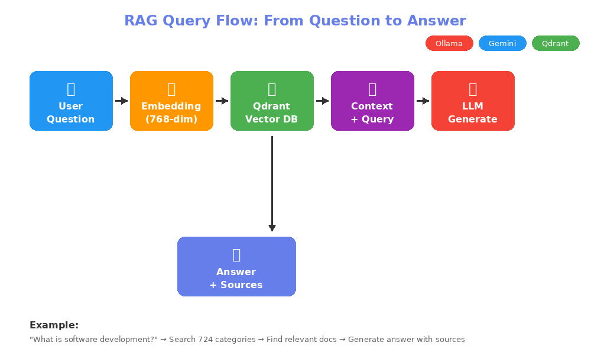

# MCP Server RAG LLM

[](https://spring.io/projects/spring-boot)
[](https://spring.io/projects/spring-ai)
[](https://www.oracle.com/java/)
[](LICENSE)

A Spring Boot-based Model Context Protocol (MCP) server implementing Retrieval-Augmented Generation (RAG) with support for multiple LLM providers (Ollama, Gemini) and communication protocols (SSE, stdio).

Built with **Spring Boot 4.0** and **Spring AI 2.0.0-M2** for cutting-edge AI integration capabilities.

## 📑 Table of Contents

- [Features](#-features)
- [Prerequisites](#-prerequisites)
- [Quick Start](#-quick-start)
- [Profile Configurations](#-profile-configurations)
- [Data Initialization](#-data-initialization)
- [Testing Different Configurations](#-testing-different-configurations)
- [Configuration Reference](#-configuration-reference)
- [API Endpoints](#-api-endpoints-sse-mode)
- [Troubleshooting](#-troubleshooting)
- [Project Structure](#-project-structure)
- [Security Notes](#-security-notes)
- [Performance Tips](#-performance-tips)
- [Extending with Other LLM Providers](#-extending-with-other-llm-providers)
- [Contributing](#-contributing)
- [License](#-license)

## 🌟 Features

- **Multiple LLM Providers**: Support for both local Ollama and Google Gemini
  - 🔌 **Extensible Architecture**: Easily add support for Azure OpenAI, ChatGPT, AWS Bedrock, and other providers
- **Dual Communication Protocols**: 
  - SSE (Server-Sent Events) for web-based integration
  - stdio for Claude Desktop integration
- **Vector Search**: Qdrant vector database for semantic search
- **Caching**: Redis for improved performance
- **Data Persistence**: H2 in-memory database for structured data
- **Pre-loaded Dataset**: IAB (Interactive Advertising Bureau) taxonomy data

## 🛠️ Tech Stack

| Technology | Version  | Purpose |
|------------|----------|---------|
| Spring Boot | 4.0      | Application framework |
| Spring AI | 2.0.0-M2 | AI/LLM integration layer |
| Java | 21+       | Programming language |
| Qdrant | Latest   | Vector database for embeddings |
| Redis | 7+       | Caching layer |
| H2 Database | Latest   | In-memory relational database |
| Docker | Latest   | Container runtime for services |
| Maven | 3.6+     | Build tool |

### Key Dependencies

```xml
<dependencyManagement>
    <dependencies>
        <dependency>
            <groupId>org.springframework.ai</groupId>
            <artifactId>spring-ai-bom</artifactId>
            <version>2.0.0-M2</version>
            <type>pom</type>
            <scope>import</scope>
        </dependency>
    </dependencies>
</dependencyManagement>

<dependencies>
    <!-- Spring AI MCP Server -->
    <dependency>
        <groupId>org.springframework.ai</groupId>
        <artifactId>spring-ai-starter-mcp-server-webmvc</artifactId>
        <version>2.0.0-M2</version>
    </dependency>
    
    <!-- LLM Providers -->
    <dependency>
        <groupId>org.springframework.ai</groupId>
        <artifactId>spring-ai-starter-model-ollama</artifactId>
    </dependency>
    
    <dependency>
        <groupId>org.springframework.ai</groupId>
        <artifactId>spring-ai-starter-model-google-genai</artifactId>
    </dependency>
    
    <!-- Vector Store -->
    <dependency>
        <groupId>org.springframework.ai</groupId>
        <artifactId>spring-ai-starter-vector-store-qdrant</artifactId>
    </dependency>
</dependencies>
```

## 🏗️ Architecture

<div align="center">


</div>

### Data Flow

1. **Initialization Phase**:
   - Load IAB taxonomy from CSV → H2 Database
   - Generate embeddings using selected LLM (Ollama/Gemini)
   - Store vectors in Qdrant (batched processing)

2. **Query Phase**:
   - User sends question via REST API or Claude Desktop
   - Question is embedded using the same model
   - Similar documents retrieved from Qdrant
   - Context + Question sent to LLM
   - Generated answer returned to user

## 🎬 Demo

### Query Flow Diagram

<div align="center">



*Simple flow showing how a user question becomes an intelligent answer*

</div>

### Example Query & Response

**Question:** *"What do you know about automotive categories?"*

**Response:**
```json
{
  "answer": "The Automotive category encompasses a comprehensive range of subcategories including Auto Parts, Auto Repair, Buying/Selling Cars, various vehicle types (Electric Vehicle, Hybrid, SUV, Sedan, Truck), Auto Insurance, and specialized areas like Classic Cars and Motorcycles.",
  "sources": [
    {
      "id": "47",
      "name": "Automotive",
      "tier1": "Automotive",
      "tier2": "Auto Type"
    }
  ],
  "relevanceScore": 0.89
}
```

### Step-by-Step Flow

1. **Question Received** → Your question arrives via REST API or Claude Desktop
2. **Embedding Generation** → Question converted to 768-dim vector (Ollama/Gemini)
3. **Vector Search** → Qdrant finds top 5 similar documents from 724 categories
4. **Context Retrieved** → Relevant IAB categories extracted
5. **LLM Processing** → Answer generated with context (Ollama/Gemini)
6. **Cache & Return** → Response cached in Redis for future queries
7. **Delivered** → JSON response with answer, sources, and confidence score

⏱️ **Total Time:** ~2-5 seconds

### Integration Examples

| Mode | Screenshot | Description |
|------|------------|-------------|
| **REST API** | `curl http://localhost:8080/api/rag/ask?question=...` | Direct HTTP endpoint for web integration |
| **SSE Streaming** | `http://localhost:8080/mcp/sse` | Server-Sent Events for real-time responses |
| **Claude Desktop** | stdio integration | Seamless integration with Claude Desktop app |

## 📋 Prerequisites

### Required Software

1. **Java 21+**
   ```bash
   java -version
   ```

2. **Maven 3.6+**
   ```bash
   mvn -version
   ```

3. **Docker & Docker Compose**
   ```bash
   docker --version
   docker-compose --version
   ```

4. **Ollama** (for local LLM support - Optional)
   ```bash
   # Install Ollama
   curl -fsSL https://ollama.com/install.sh | sh
   
   # Pull required models
   ollama pull llama2
   ollama pull nomic-embed-text
   
   # Verify installation
   ollama list
   ```

5. **Google Gemini API Key** (Required for Gemini support)
   
   **Get your free API key:**
   1. Visit [Google AI Studio](https://makersuite.google.com/app/apikey)
   2. Sign in with your Google account
   3. Click "Create API Key"
   4. Copy the generated API key
   5. Enable the "Generative Language API" if prompted
   
   **Important:** 
   - Free tier includes 15 requests/minute and 1M tokens/day
   - No credit card required for free tier
   - Store your API key securely (never commit to Git)

### Start Required Services

Create a `docker-compose.yml` file:

```yaml
version: '3.8'

services:
  qdrant:
    image: qdrant/qdrant:latest
    ports:
      - "6333:6333"
      - "6334:6334"
    volumes:
      - qdrant_storage:/qdrant/storage
    environment:
      - QDRANT__SERVICE__GRPC_PORT=6334

  redis:
    image: redis:7-alpine
    ports:
      - "6379:6379"
    volumes:
      - redis_data:/data

volumes:
  qdrant_storage:
  redis_data:
```

Start the services:
```bash
docker-compose up -d
```

Verify services are running:
```bash
# Check Qdrant
curl http://localhost:6333/health

#Get redis container id
docker ps -a

# Check Redis
docker exec -it {replace_with_redis_container_id} redis-cli KEYS "*"
```

## 🚀 Quick Start

> **⚡ TL;DR**: Get started in 3 commands
> ```bash
> docker-compose up -d              # Start Qdrant & Redis
> ollama pull llama2 nomic-embed-text   # Pull Ollama models (optional)
> mvn spring-boot:run -Dspring-boot.run.profiles=sse,ollama
> ```

### Detailed Setup

### 1. Clone the Repository

```bash
git clone https://github.com/afsarkhan05/mcp-server-rag-llm.git
cd mcp-server-rag-llm
git checkout main-claude-redis-qdrant-ollama
```

### 2. Configure Application

Update `src/main/resources/application.yml` with your settings:

```yaml
spring:
  ai:
    google:
      genai:
        api-key: "YOUR_GEMINI_API_KEY_HERE"  # Only needed for Gemini profile
```

### 3. Build the Application

```bash
mvn clean install
```

## 🎯 Profile Configurations

The application supports multiple Spring profiles that can be combined to achieve different configurations.

### Profile Matrix

| Profile | Description                                           | Embedding Model           | Resioning Model |
|--------|-------------------------------------------------------|---------------------------|----------|
| `sse`,`gemini` | Server-Sent Events communication for web/remote integrations. | gemini                    | gemini   |
| `sse`,`ollama` | Server-Sent Events communication for web/remote integrations. | ollama (local)            | ollama (local) |
| `stdio`,`gemini` | Standard I/O for Claude Desktop integration           | gemini                    | claude desktop |
| `stdio`,`ollama` | Standard I/O for Claude Desktop integration           | ollama (local)            | claude desktop |
| `stdio` | Standard I/O for Claude Desktop integration           | ollama (local as default) | claude desktop ||


### Communication Protocol Profiles

#### SSE (Default)
Server-Sent Events for web-based integration and REST API access.

```bash
# Start with SSE (default)
mvn spring-boot:run

# Or explicitly
mvn spring-boot:run -Dspring-boot.run.profiles=sse
```

**Endpoints:**
- Health: `http://localhost:8080/actuator/health`
- Ask Question: `http://localhost:8080/api/rag/ask?question=your-question`
- MCP SSE: `http://localhost:8080/mcp/sse`

#### stdio
Standard I/O for Claude Desktop integration.

```bash
mvn spring-boot:run -Dspring-boot.run.profiles=stdio
```

**Claude Desktop Configuration** (`claude_desktop_config.json`):
```json
{
   "mcpServers": {
      "spring-book-server": {
         "command": "bash",
         "args": [
            "-c",
            "java -Dspring.ai.mcp.server.stdio=true -Dspring.main.banner-mode=off -Dlogging.level.root=OFF -Dlogging.level.org.springframework=OFF -Dlogging.level.org.hibernate=OFF -Dlogging.pattern.console= -jar /absolute/path/to/jar/mcp-rag-llm-service-1.0-SNAPSHOT.jar 2>/dev/null"
         ]
      }
   },
   "preferences": {
      "sidebarMode": "chat",
      "coworkScheduledTasksEnabled": false
   }
}
```

### LLM Provider Profiles

#### 1. SSE + Ollama (Local, No API Key Required)

```bash
mvn spring-boot:run -Dspring-boot.run.profiles=sse,ollama
```

**Configuration:**
- Embedding Model: `all-minilm:latest`
- Chat Model: `llama2` or `phi3:mini`
- Vector Dimension: 768
- Communication: REST API + SSE

**Use Case:** Development, testing, no internet required, free

#### 2. SSE + Gemini (Cloud-based)

```bash
mvn spring-boot:run -Dspring-boot.run.profiles=sse,gemini
```

**Configuration:**
- Embedding Model: `gemini-embedding-001`
- Chat Model: `gemini-2.0-flash`
- Vector Dimension: 768
- Communication: REST API + SSE

**Use Case:** Production, better performance, requires API key and internet

#### 3. stdio + Ollama (Claude Desktop Integration)

```bash
mvn spring-boot:run -Dspring-boot.run.profiles=stdio,ollama
```

**Configuration:**
- Uses Claude for reasoning via Claude Desktop
- Uses Ollama for embeddings only
- Communication: stdio

**Use Case:** Claude Desktop integration with local embeddings

#### 4. stdio + Gemini (Claude Desktop Integration)

```bash
mvn spring-boot:run -Dspring-boot.run.profiles=stdio,gemini
```

**Configuration:**
- Uses Claude for reasoning via Claude Desktop
- Uses Gemini for embeddings
- Communication: stdio

**Use Case:** Claude Desktop integration with cloud embeddings

## 📊 Data Initialization

On startup, the application automatically:

1. **Loads IAB taxonomy** from `src/main/resources/iab.csv`
2. **Stores structured data** in H2 database
3. **Generates embeddings** for each IAB category
4. **Indexes to Qdrant** in batches of 100 (respects API limits)

**IAB Dataset:** Contains 700+ advertising categories organized in tiers (Tier 1 → Tier 4)

### Monitoring Data Load

Check logs for:
```shell
13:10:53.887 [main] INFO  o.s.a.m.s.c.a.McpServerAutoConfiguration - Registered tools: 6
13:10:53.889 [main] INFO  o.s.a.m.s.c.a.McpServerAutoConfiguration - Enable resources capabilities, notification: true
13:10:56.639 [main] INFO  o.s.boot.tomcat.TomcatWebServer - Tomcat started on port 8080 (http) with context path '/'
```

```
INFO  Loading IAB data from CSV...
INFO  Loaded 724 IAB categories
INFO  Preparing to load 724 documents into vector store
INFO  Processing batch 1/8: documents 1 to 100
INFO  Successfully loaded all 724 documents
```

## 🧪 Testing Different Configurations

### Test 1: Local Setup (No API Key Required)

```bash
cd mcp-rag-llm-service

# Terminal 1: Start services (docker-compose.yaml)
docker-compose up -d

# Terminal 2: Start application with Ollama
mvn spring-boot:run -Dspring-boot.run.profiles=sse,ollama

# Test Qdrant up and embedding done
http://localhost:6333/dashboard#/collections

# Terminal 3: Test the API
curl "http://localhost:8080/api/rag/ask?question=what%20is%20software%20development"
```

### Test 2: Cloud-based Setup (Gemini)

```bash
# Update application.yml with your Gemini API key
# Start application
mvn spring-boot:run -Dspring-boot.run.profiles=sse,gemini

# Test
curl "http://localhost:8080/api/rag/ask?question=what%20categories%20are%20under%20technology"
```

### Test 3: Claude Desktop Integration (Ollama)

```bash
# Build JAR
mvn clean package

# Update Claude Desktop config
# Start Claude Desktop - it will launch the server automatically
```

### Test 4: Claude Desktop Integration (Gemini)

Update `claude_desktop_config.json`:
```json
{
  "mcpServers": {
    "rag-llm": {
      "command": "java",
      "args": [
        "-jar",
        "/path/to/mcp-rag-llm-service-1.0-SNAPSHOT.jar",
        "--spring.profiles.active=stdio,gemini"
      ],
      "env": {
        "SPRING_AI_GOOGLE_GENAI_API_KEY": "your-api-key-here"
      }
    }
  }
}
```

## 🔧 Configuration Reference

### application.yml Structure

```yaml
# Communication Protocol
server:
  port: 8080  # Only for SSE mode


spring:
  profiles:
    active: ${SPRING_PROFILES_ACTIVE:sse},gemini(or ollama) # example active: sse,gemini
```

```yaml
  # Ollama Configuration
spring:
  ai:
     ollama:
        base-url: http://localhost:11434 #http://host.docker.internal:11434
        chat:
           options:
              model: phi3:mini #llama3.1:8b
        embedding:
           enabled: true
           options:
              model: all-minilm:latest
```

```yaml
  # Gemini Configuration
spring:
  ai:
     google:
        genai:
           api-key: "{API_KEY}"
           chat:
              options:
                 model: gemini-2.0-flash
           embedding:
              enabled: true
              model: gemini-embedding-001 #embedding-001 #text-embedding-004
```

```yaml
spring:
  # Vector Store
   ai:
    vectorstore:
      qdrant:
         host: localhost
         port: 6334
         #api-key=<your api key>
         collection-name: "gemini_qdrant_without_llm" #redis_qdrant_collection
         # Optional: automatically create the schema/collection if it doesn't exist
         initialize-schema: true
```
```yaml
  # Redis Configuration
spring:
  data:
     redis:
        host: localhost
        port: 6379
        timeout: 2000ms
        lettuce:
           pool:
              max-active: 8
              max-idle: 8
              min-idle: 0
```

```yaml
spring:
  # H2 Database Configuration
  datasource:
     url: jdbc:h2:mem:rag-llm
     driver-class-name: org.h2.Driver
     username: sa
     password: password

  jpa:
     database-platform: org.hibernate.dialect.H2Dialect
     hibernate:
        ddl-auto: create-drop

     show-sql: false
     properties:
        hibernate:
           format_sql: false

  h2:
     console:
        enabled: true
        path: /h2-console
```

### Environment Variables

```bash
# Set LLM provider
export LLM_PROVIDER=gemini

# Set Gemini API key
export GEMINI_API_KEY=your-api-key-here

# Set active profiles
export SPRING_PROFILES_ACTIVE=sse,gemini

# Run application
mvn spring-boot:run
```

## 📡 API Endpoints (SSE Mode)

### Health Check
```bash
curl http://localhost:8080/actuator/health
```

### Ask Question (RAG)
```bash
curl -G "http://localhost:8080/api/rag/ask" \
  --data-urlencode "question=what is automotive category?"
```

**Response:**
```json
{
  "answer": "The Automotive category includes subcategories like Auto Parts, Auto Repair, Buying/Selling Cars, Car Culture, Certified Pre-Owned, Convertible, Coupe, Crossover, Diesel, Electric Vehicle, Hatchback, Hybrid, Luxury, MiniVan, Motorcycles, Off-Road Vehicles, Performance Vehicles, Pickup, Road-Side Assistance, Sedan, Trucks & Accessories, Vintage Cars, Wagon, Auto Type, Auto Body Styles, Auto Safety, Auto Buying and Selling, Auto Technology, Auto Rentals, Auto Insurance.",
  "sources": [
    {
      "id": "47",
      "name": "Automotive",
      "tier1": "Automotive"
    }
  ],
  "relevanceScore": 0.92
}
```

### H2 Console (Development)
```
http://localhost:8080/h2-console

JDBC URL: jdbc:h2:mem:iabdb
Username: sa
Password: (leave blank)
```

## 🐛 Troubleshooting

### Issue: "Failed to connect to Qdrant"
**Solution:**
```bash
# Check if Qdrant is running
docker ps | grep qdrant

# Restart if needed
docker-compose restart qdrant
```

### Issue: "Ollama model not found"
**Solution:**
```bash
# Pull required models
ollama pull llama2
ollama pull all-minilm:latest
ollama pull phi3:mini

# Verify available models
ollama list
```

### Issue: "API key not valid" (Gemini)
**Solution:**
- Verify API key at https://makersuite.google.com/app/apikey
- Check key has Generative Language API enabled
- Update `application.yml` or set environment variable

### Issue: "Quota exceeded" (Gemini)
**Solution:**
- Free tier has limits: 15 requests/minute
- Wait 60 seconds before retrying
- Consider upgrading to paid tier
- Or switch to Ollama profile

### Issue: "Vector dimension mismatch"
**Solution:**
```bash
# Delete and recreate Qdrant collection
curl -X DELETE http://localhost:6333/collections/{your_collection_name}

# Restart application to recreate with correct dimensions
```

### Issue: Data not loading on startup
**Solution:**
```bash
# Check if iab.csv exists
ls -la src/main/resources/iab.csv

# Check logs for batch processing
tail -f logs/application.log | grep "Processing batch"
```

## 📁 Project Structure

```
mcp-server-rag-llm/
├── src/
│   ├── main/
│   │   ├── java/
│   │   │   └── com/mcp/rag/llm/
│   │   │       ├── config/          # Configuration classes
│   │   │       │   ├── DataInitializer.java
│   │   │       │   ├── GeminiConfig.java
│   │   │       │   └── OllamaConfig.java
│   │   │       ├── controller/      # REST controllers
│   │   │       ├── service/         # Business logic
│   │   │       └── model/           # Data models
│   │   └── resources/
│   │       ├── application.yml
│   │       ├── application-sse.yml
│   │       ├── application-stdio.yml
│   │       ├── application-ollama.yml
│   │       ├── application-gemini.yml
│   │       └── iab.csv              # IAB taxonomy data
├── docker-compose.yml
├── pom.xml
└── README.md
```

## 🔐 Security Notes

1. **Never commit API keys** to version control
2. Use environment variables for sensitive data
3. For production, use proper secret management (AWS Secrets Manager, HashiCorp Vault, etc.)
4. Enable authentication for REST endpoints in production

## 📈 Performance Tips

1. **Use Gemini for production**: Better quality and faster responses
2. **Use Ollama for development**: No cost, no rate limits
3. **Adjust batch size**: Reduce if hitting API limits (default: 100)
4. **Redis caching**: Enable for frequently asked questions
5. **Vector dimension**: 768 is optimal for both models

## 🔌 Extending with Other LLM Providers

The application is designed with extensibility in mind. You can easily add support for additional LLM providers:

### Supported by Spring AI (Easy Integration)

The following providers can be added by including the appropriate Spring AI starter dependency:

1. **Azure OpenAI**
   ```xml
   <dependency>
       <groupId>org.springframework.ai</groupId>
       <artifactId>spring-ai-azure-openai-spring-boot-starter</artifactId>
   </dependency>
   ```

2. **OpenAI (ChatGPT)**
   ```xml
   <dependency>
       <groupId>org.springframework.ai</groupId>
       <artifactId>spring-ai-openai-spring-boot-starter</artifactId>
   </dependency>
   ```

3. **AWS Bedrock**
   ```xml
   <dependency>
       <groupId>org.springframework.ai</groupId>
       <artifactId>spring-ai-bedrock-spring-boot-starter</artifactId>
   </dependency>
   ```

4. **Anthropic Claude API**
   ```xml
   <dependency>
       <groupId>org.springframework.ai</groupId>
       <artifactId>spring-ai-anthropic-spring-boot-starter</artifactId>
   </dependency>
   ```

5. **Hugging Face**
   ```xml
   <dependency>
       <groupId>org.springframework.ai</groupId>
       <artifactId>spring-ai-huggingface-spring-boot-starter</artifactId>
   </dependency>
   ```

### How to Add a New Provider

**Step 1:** Add the Maven dependency for your chosen provider

**Step 2:** Create a configuration class (follow the pattern of `OllamaConfig.java` or `GeminiConfig.java`)

```java
@Configuration
@ConditionalOnProperty(name = "llm.provider", havingValue = "azure")
public class AzureOpenAIConfig {
    
    @Bean
    @Primary
    public ChatModel azureChatModel() {
        // Configure Azure OpenAI chat model
    }
    
    @Bean
    @Primary
    public EmbeddingModel azureEmbeddingModel() {
        // Configure Azure OpenAI embedding model
    }
}
```

**Step 3:** Create a profile-specific configuration file

```yaml
# application-azure.yml
llm:
  provider: azure

spring:
  ai:
    azure:
      openai:
        api-key: ${AZURE_OPENAI_API_KEY}
        endpoint: ${AZURE_OPENAI_ENDPOINT}
        chat:
          options:
            model: gpt-4
        embedding:
          options:
            model: text-embedding-ada-002
```

**Step 4:** Run with your new profile

```bash
mvn spring-boot:run -Dspring-boot.run.profiles=sse,azure
```

### Example: Adding OpenAI Support

1. **Add dependency** in `pom.xml`:
```xml
<dependency>
    <groupId>org.springframework.ai</groupId>
    <artifactId>spring-ai-openai-spring-boot-starter</artifactId>
</dependency>
```

2. **Create** `application-openai.yml`:
```yaml
llm:
  provider: openai

spring:
  ai:
    openai:
      api-key: ${OPENAI_API_KEY}
      chat:
        options:
          model: gpt-4o
          temperature: 0.7
      embedding:
        options:
          model: text-embedding-3-small

    vectorstore:
      qdrant:
        vector-dimension: 1536  # OpenAI embedding dimension
```

3. **Create** `OpenAIConfig.java`:
```java
@Configuration
@ConditionalOnProperty(name = "llm.provider", havingValue = "openai")
public class OpenAIConfig {
    // Spring AI will auto-configure based on application-openai.yml
}
```

4. **Run**:
```bash
export OPENAI_API_KEY=sk-your-key-here
mvn spring-boot:run -Dspring-boot.run.profiles=sse,openai
```

### Contribution Welcome!

We welcome contributions to add support for more LLM providers! Please follow the existing patterns and submit a PR.

**Popular requests:**
- ✅ Ollama (Implemented)
- ✅ Google Gemini (Implemented)
- 🔄 Azure OpenAI (Community contribution welcome)
- 🔄 OpenAI/ChatGPT (Community contribution welcome)
- 🔄 AWS Bedrock (Community contribution welcome)
- 🔄 Anthropic Claude API (Community contribution welcome)
- 🔄 Cohere (Community contribution welcome)

## 🤝 Contributing

Contributions are welcome! We'd love your help to make this project better.

### How to Contribute

1. **Fork** the repository
2. **Clone** your fork
   ```bash
   git clone https://github.com/YOUR_USERNAME/mcp-server-rag-llm.git
   cd mcp-server-rag-llm
   git checkout main-claude-redis-qdrant-ollama
   ```
3. **Create** a feature branch
   ```bash
   git checkout -b feature/amazing-feature
   ```
4. **Make** your changes
5. **Test** your changes
   ```bash
   mvn clean test
   mvn spring-boot:run -Dspring-boot.run.profiles=sse,ollama
   ```
6. **Commit** your changes
   ```bash
   git commit -m 'Add: amazing feature description'
   ```
7. **Push** to your branch
   ```bash
   git push origin feature/amazing-feature
   ```
8. **Open** a Pull Request

### Contribution Ideas

- 🔌 Add new LLM provider integrations (Azure OpenAI, ChatGPT, AWS Bedrock)
- 📊 Improve RAG performance and accuracy
- 🎨 Create example notebooks or tutorials
- 🐛 Fix bugs or improve error handling
- 📝 Improve documentation
- ✅ Add more test coverage
- 🚀 Performance optimizations

### Code Style

- Follow Java conventions and Spring Boot best practices
- Write clear commit messages
- Add comments for complex logic
- Update README if adding new features
- Include tests for new functionality

### Issues & Bug Reports

Found a bug? Have a feature request? Please [open an issue](https://github.com/afsarkhan05/mcp-server-rag-llm/issues/new) with:
- Clear description
- Steps to reproduce (for bugs)
- Expected vs actual behavior
- Your environment (OS, Java version, etc.)

## 📝 License

This project is licensed under the MIT License - see the LICENSE file for details.

## 🙏 Acknowledgments

- [Spring AI](https://spring.io/projects/spring-ai)
- [Ollama](https://ollama.ai/)
- [Qdrant](https://qdrant.tech/)
- [Google Gemini](https://ai.google.dev/)
- [Anthropic Claude](https://www.anthropic.com/)

## ❓ FAQ

<details>
<summary><strong>Q: Can I use this without any cloud API keys?</strong></summary>

Yes! Use the `ollama` profile for completely local operation:
```bash
mvn spring-boot:run -Dspring-boot.run.profiles=sse,ollama
```
No internet or API keys required.
</details>

<details>
<summary><strong>Q: Which LLM provider should I use?</strong></summary>

- **Development/Testing**: Use Ollama (free, local, no limits)
- **Production**: Use Gemini (better quality, faster, requires API key)
- **Privacy-sensitive**: Use Ollama (all data stays local)
</details>

<details>
<summary><strong>Q: How do I switch between Ollama and Gemini?</strong></summary>

Just change the profile when starting the application:
```bash
# Ollama
mvn spring-boot:run -Dspring-boot.run.profiles=sse,ollama

# Gemini
mvn spring-boot:run -Dspring-boot.run.profiles=sse,gemini
```
</details>

<details>
<summary><strong>Q: Can I use my own data instead of IAB taxonomy?</strong></summary>

Yes! Modify `DataInitializer.java` to load your own CSV or data source. The IAB data is just an example dataset.
</details>

<details>
<summary><strong>Q: What's the difference between SSE and stdio modes?</strong></summary>

- **SSE (sse)**: Server-Sent Events, use for web APIs and REST endpoints
- **stdio (stdio)**: Standard I/O, use for Claude Desktop integration
</details>

<details>
<summary><strong>Q: How many documents can I index?</strong></summary>

The application batches processing (100 documents at a time) to respect API limits. You can index thousands of documents, but:
- Ollama: No practical limit
- Gemini: Free tier has rate limits (15 req/min)
</details>

<details>
<summary><strong>Q: Can I deploy this to production?</strong></summary>

Yes! For production:
1. Use Gemini or enterprise LLM provider
2. Configure proper authentication
3. Use managed services for Qdrant/Redis
4. Enable HTTPS
5. Set up monitoring and logging
6. Use environment variables for secrets
</details>

<details>
<summary><strong>Q: What are the system requirements?</strong></summary>

**Minimum:**
- CPU: 2 cores
- RAM: 4GB (8GB recommended with Ollama)
- Disk: 10GB free space

**Recommended:**
- CPU: 4+ cores
- RAM: 16GB (if running Ollama locally)
- Disk: 20GB+ free space
- GPU: Optional but improves Ollama performance
</details>

## 📞 Support

For issues, questions, or contributions, please:

- 🐛 **Report Bugs**: [Open an issue](https://github.com/afsarkhan05/mcp-server-rag-llm/issues/new?template=bug_report.md)
- 💡 **Request Features**: [Open an issue](https://github.com/afsarkhan05/mcp-server-rag-llm/issues/new?template=feature_request.md)
- 💬 **Ask Questions**: [Discussions](https://github.com/afsarkhan05/mcp-server-rag-llm/discussions)
- 📧 **Email**: [your-email@example.com](mailto:your-email@example.com)

### Community

- ⭐ **Star** this repo if you find it useful!
- 🔄 **Share** with others who might benefit
- 🤝 **Contribute** to make it better

## 📊 Project Stats


## 🌟 Stargazers

[](https://github.com/afsarkhan05/mcp-server-rag-llm/stargazers)

## 🍴 Forkers

[](https://github.com/afsarkhan05/mcp-server-rag-llm/network/members)

---

<div align="center">

### 💝 Show Your Support

If this project helped you, please consider giving it a ⭐!

[](https://star-history.com/#afsarkhan05/mcp-server-rag-llm&Date)

**Made with ❤️ using Spring Boot 4.0 & Spring AI 2.0**

[Report Bug](https://github.com/afsarkhan05/mcp-server-rag-llm/issues) · 
[Request Feature](https://github.com/afsarkhan05/mcp-server-rag-llm/issues) · 
[View Discussions](https://github.com/afsarkhan05/mcp-server-rag-llm/discussions)

**Happy Coding! 🚀**

</div>
